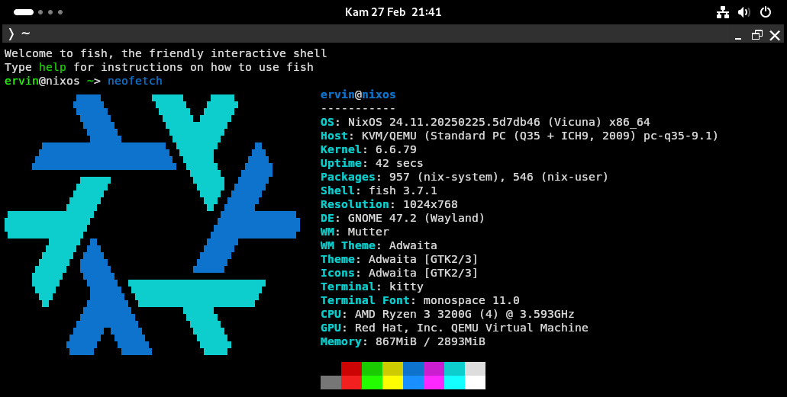

# NixOS Minimal Configuration

Lightweight NixOS configuration optimized for minimal initial build size, containing only essential packages. Optional packages are commented out for easier customization.

## Screenshots

## Acknowledgements

 - [Nix Flakes](https://nixos.wiki/wiki/Flakes)
 - [How to Install NixOS](https://nixos.org/manual/nixos/stable/)
 - [List of Packages in NixOS](https://search.nixos.org/packages)

## Contributing

Contributions are always welcome!

## Contributors

- [@ervinerviansyah](https://www.github.com/ervinerviansyah)

## License

This configuration is [unlicense](https://unlicense.org). You may use and modify it freely at your own risk. No attribution is required, though this README should be kept intact when sharing modified versions.

This configuration is provided as-is without any formal license or warranty. You may use and modify it freely at your own risk. No attribution is required, though this README should be kept intact when sharing modified versions.

## Warning

Always review configurations from unknown sources before applying to your system 
